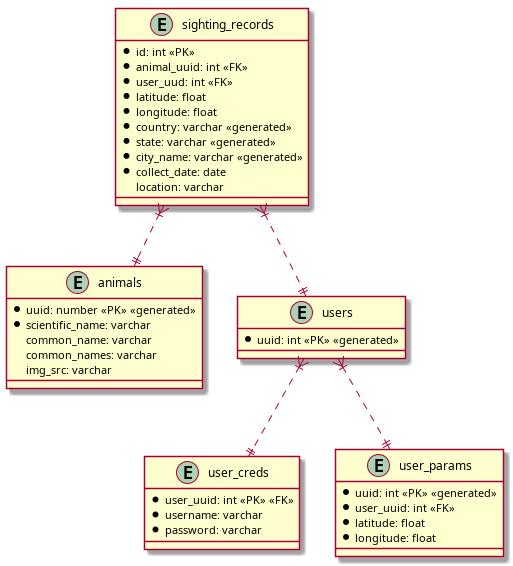

# Instrucciones: Editor de Polígonos en MAPS
+ Parte A: Generar un catalogo de especies endémicas (animales y plantas)
+ Parte B: Solicitar un parámetro (kilómetros cuadrados), y que el usuario pueda arrastrar dicha cuadricula sobre el MAPA para generar la posición inicial
+ Parte C: Generar el resto de la cuadricula, excluyendo los limites con otros  estados, países o limites marítimos y guardar esta cuadricula como una  configuración (se pueden soportar N configuraciones)
+ Parte D: El usuario "final", debe seleccionar la cuadricula de su ubicación  (en teoría, esto debería ser automático con la ubicación GPS, pero no van a ir hasta Marihuana para validar este enfoque) y seleccionar una especie del catalogo. Al hacer esto, se debe incrementar el conteo de dicha especie en una BD 
+ Parte E: El mismo usuario final puede consultar por cuadricula los 
	avistamientos de ciertas especies. Ademas, en base al total, poner un 
	semáforo de 5 tonos avistamientos (ROJO: Cero avistamientos con respecto al numero de especies,... hasta verde: Muchos avistamientos de muchas especies, pasando por los colores intermedios)

## Pasos para iniciar un proyecto en firebase
_Importante no usar **Realtime Database** (usar Firestore Database) porque la documentación no esta actualizada así que es más dificl de utilizar._
1. Añadir al `gradle.settings.kts`:
``` kotlin
dependencies {
	implementation("com.google.firebase:firebase-admin:9.2.0")
	// Logers para firebase, sin estas dependencias gradle no deja compilar
	implementation ("org.slf4j:slf4j-api:1.7.32")
	implementation ("ch.qos.logback:logback-classic:1.2.6")
	implementation ("org.slf4j:slf4j-nop:2.0.7")
}
```
2. Credenciales
   Ir a [la consola](https://console.firebase.google.com/) **Desc. gen. del proyecto->Config. del proyecto->Cuentas de servicio**  y generar una _nueva clave privada_
3. Conectar a la base de datos:
``` kotlin
try {
	val json = FileInputStream("src/main/resources/${archivo}.json")
	val options = FirebaseOptions.builder()
		.setCredentials(GoogleCredentials.fromStream(json))
		.setDatabaseUrl("https://${url}.firebaseio.com/")
		.build()
	FirebaseApp.initializeApp(options)
} catch(e: Exception) {
	print(e.message)
}
```
4. Crear usuario en todos los proyectos de firebase:
``` kotlin
val auth = FirebaseAuth.getInstance()
val user = UserRecord.CreateRequest().setEmail("correo@gmail.com").setPassword("password")
auth.createUser(user)
```

## Base de datos
Para la base de datos se utilizó el catálogo taxonómico de la página [snib](https://www.snib.mx/taxonomia/descarga/). Se hizo una consulta de especies del reino _Animalia_ en la region de México Tamaulipas. Estos datos incluyen datos importantes para la aplicación como la localización exacta donde ocurrió el avistamiento, la fecha de cuando ocurrió, nombre científico, etc.

A través de python se filtraron solo las filas de especies endémicas, y por último se utilizó la _API_ de [enciclovida](https://enciclovida.conabio.gob.mx/docs) para obtener nombres comunes de cada especie y su respectiva imagen.



## Referencias
+ [Abstraer datos a json](./2024-02-22-23-13-51.md)
+ [UUID en kotlin](https://developer.android.com/reference/kotlin/java/util/UUID)
+ [API de wikimedia](./2024-02-23-20-45-21.md)
+ [Añadir firebase al proyecto](https://firebase.google.com/docs/admin/setup#linux-or-macos)
+ [Seguridad de la base de datos](https://firebase.google.com/docs/database/security)
+ [API conabio: Enciclovida](https://enciclovida.conabio.gob.mx/docs#/)
+ [auth firebase](https://firebase.google.com/docs/auth/android/start)
+ [geopoint](https://firebase.google.com/docs/reference/kotlin/com/google/firebase/firestore/GeoPoint)
+ [subir datos a la bd](https://firebase.google.com/docs/firestore/manage-data/add-data#kotlin+ktx)
+ [queries en firebase](https://firebase.google.com/docs/firestore/query-data/queries)
 
